# Regularization effect on autoencoder

by Willis Chau  

**Abstract**  
This project is to study the regularization effect on 1-layer autoencoder. 
the following scenarios are studied
1. L1 is applied on the encoder layer (activity + kernel);
2. L2 is applied on the encoder layer (activity + kernel);
3. Dropout layer is applied on the encoder layer;
4. L1 applied on both encoder and decoder layer (kernel);
5. L2 applied on both encoder and decoder layer (kernel).

MNIST handwriting dataset is used in this study. And the study is structured as below: 

|Content|
|:---|
|1. [Model architecture](#1-model-architecture)|
|2. [MSE loss comparison](#2-mse-loss-comparison)|
|3. [Sparsity comparison](#3-sparsity-comparison)|
|4. [Encoder weight matrix behaviour](#4-encoder-weight-matrix-behaviour)|
|5. [Original image vs latent space vs reconstructed image](#5-original-image-vs-latent-space-vs-reconstructed-image)|
|6. [Cosine similarity of same vs different digit](#6-cosine-similarity-of-same-vs-different-digit)|
|7. [Euclidean distance behavior](#7-euclidean-distance-behavior)|

---
## 1. Model architecture

1-layer autoencoder is used in this study, and the model architecture is following:

***Encoding layer:***  
 
where  is activation function *ReLU*, 
and the number of hidden units in *h* is 196. Hence *h* is a 196x1 vector in **196-dim latent space**, 
 is 196x748 weight matrix and 
 is the bias term in the form of 196x1 vector.
   
***Dropout layer:***  
For the *scenario 3*, `dropout_rate` ranged from 0 to .9 to control the percentage of hidden unit to learn.

***Decoding layer:***  
, 
where  is activation function *sigmoid*, 
*x'* is the output of the autoencoder which is optimized to reconstruct back to input *x*.

***Loss function:***  
L1 is applied on the encoder layer (activity + kernel): 
  
L2 is applied on the encoder layer (activity + kernel): 
  
Dropout layer is applied on the encoder layer: 
  
L1 applied on both encoder and decoder layer (kernel): 
  
L2 applied on both encoder and decoder layer (kernel): 
  

## 2. MSE loss comparison

The MSE loss of all regularized autoencoders increase as the regularization parameters (l1, l2, dropout rate) increase.
Among all the studied cases, L2 activity regularizer on encoder layer increases the loss the least [figure1a];
L1 kernel regularizer on both encoder and decoder layer increase the loss the most [figure1b];
Applying dropout on encoder layer differs the MSE loss of train and test set the most [figure1c].

|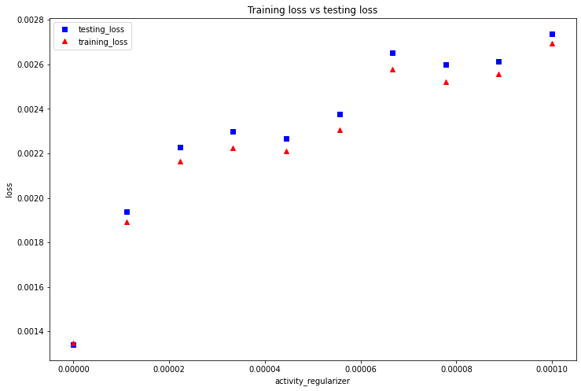|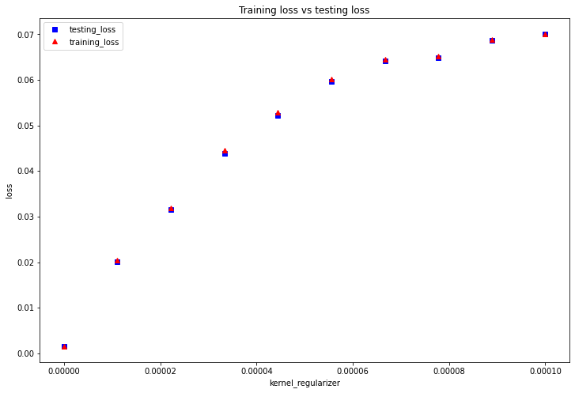|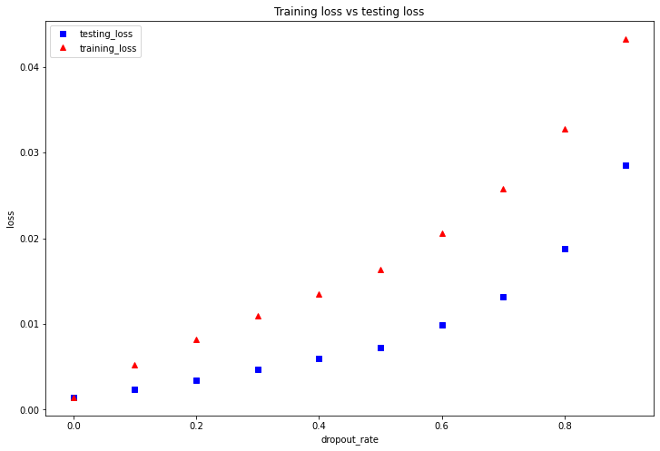|
|---|---|---|
|figure1a|figure1b|figure1c|

figure1a: MSE loss of L2 activity regularizer on encoder layer 
figure1b: MSE loss of L1 kernel regularizer on both encoder and decoder layer 
figure1c: MSE loss of applying dropout on encoder layer

## 3. Sparsity comparison

As expected, L1/L2 activity regularizer and dropout layer cause *sparsity 
(# of nonzero / total # of values)* on latent space [figure2a,2b,2c]. 
Moreover, L1 kernel regularizer on encoder and encoder + decoder also cause sparsity on latent space [figure3a,3b].

|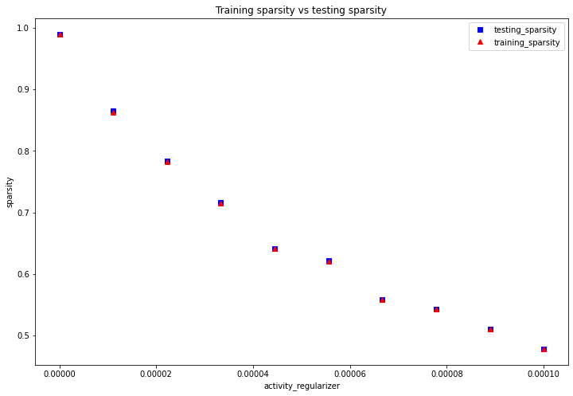|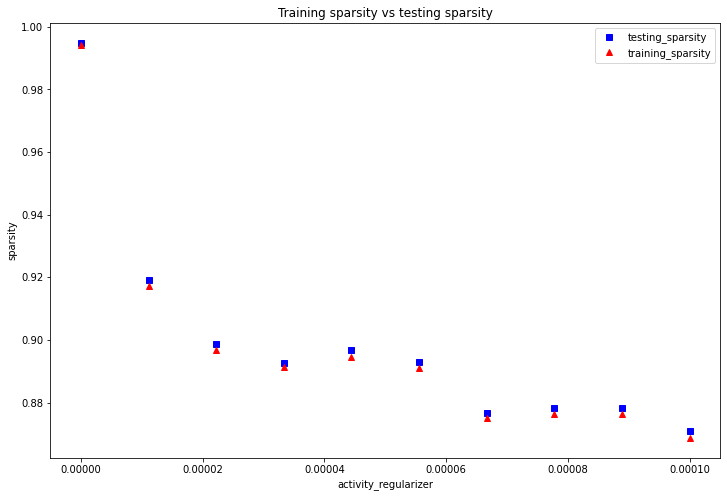|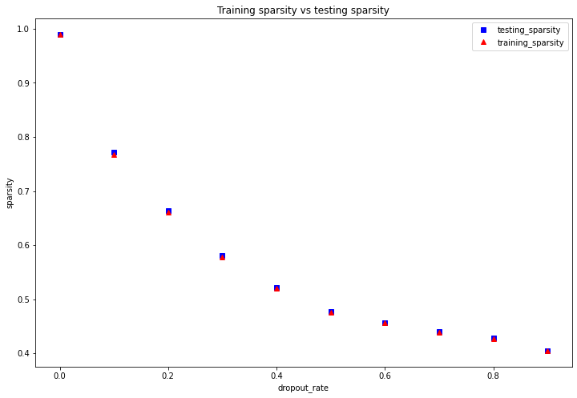|
|---|---|---|
|figure2a|figure2b|figure2c|

|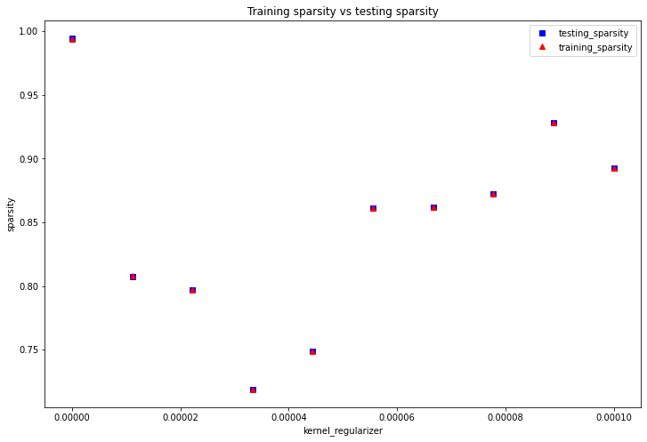|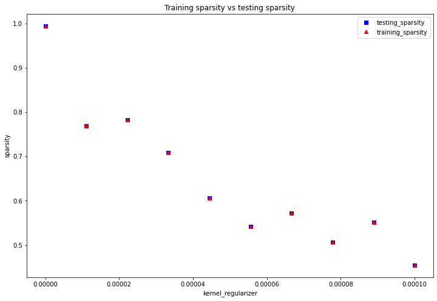|
|---|---|
|figure3a|figure3b|

figure2a: Sparsity of L1 activity regularizer on encoder layer 
figure2b: Sparsity of L2 activity regularizer on encoder layer 
figure2c: Sparsity of applying dropout on encoder layer 
figure3a: Sparsity of L1 kernel regularizer on encoder layer 
figure3b: Sparsity of L1 kernel regularizer on both encoder and decoder layer

## 4. Encoder weight matrix behaviour

Encoder weight matrix () 
is largely deactivated by L1 kernel regularizer on both encoder and encoder + decoder layer [figure4a,4b], 
whereas  from 
L1 kernel regularizer on encoder + decoder layer is basically noise, which might due to deactivation of 
 
caused by L1 kernel regularization on decoder end [figure4c,4d].

|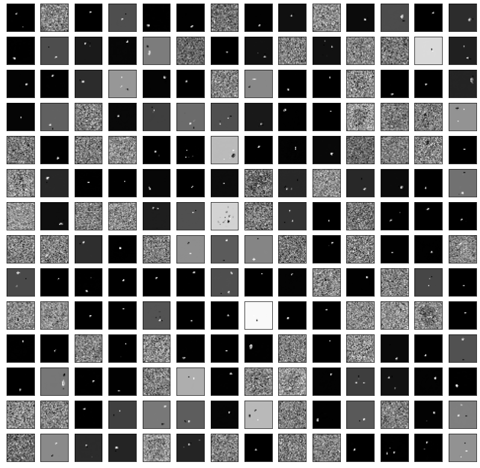|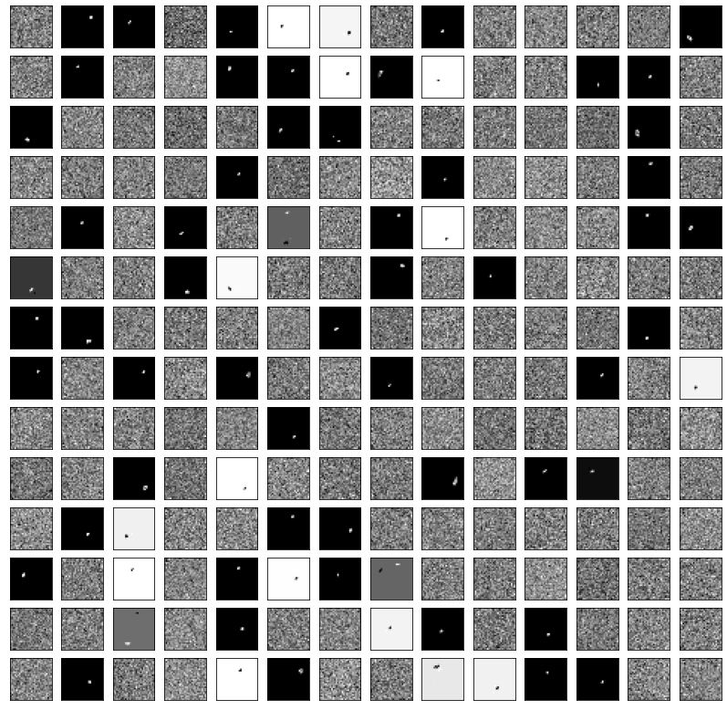|
|---|---|
|figure4a|figure4b|

|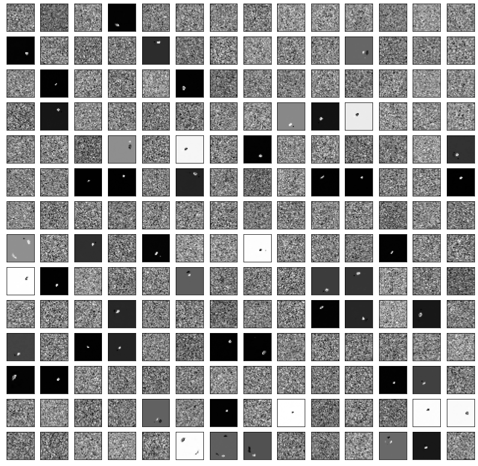|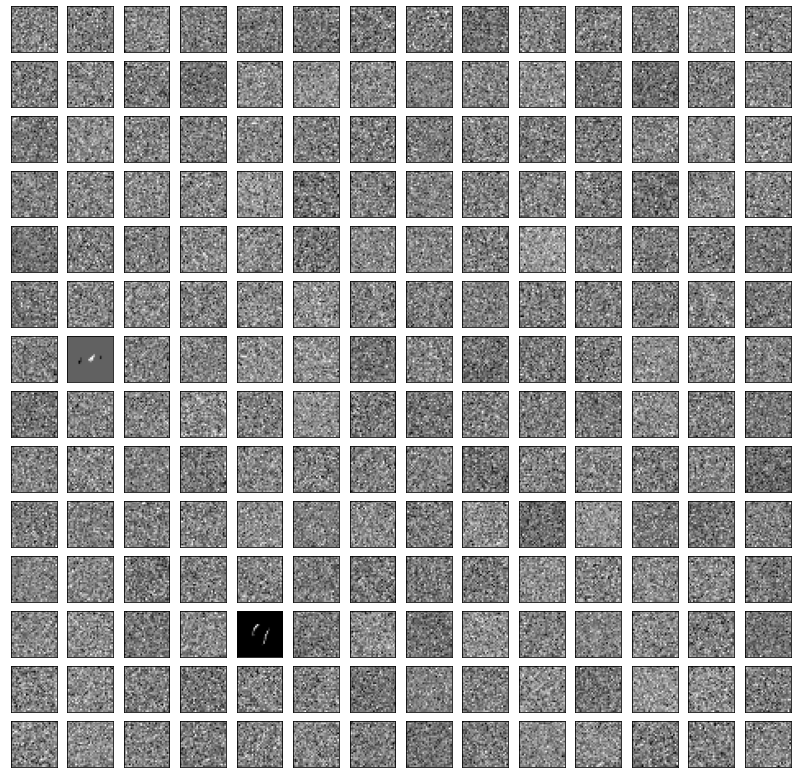|
|---|---|
|figure4c|figure4d|

figure4a,4c: Encoder weight matrix of L1 kernel regularizer on encoder layer 
figure4b,4d: Encoder weight matrix of L1 kernel regularizer on both encoder and decoder layer 
figure4a,4b: {'activity_regularizer': 0.0, 'kernel_regularizer': 1.1111111111111112e-05} 
figure4c,4d: {'activity_regularizer': 0.0, 'kernel_regularizer': 0.0001}

 
 

 from 
L1/L2 activity regularizer capture the global features from the original images, 
it is why some numbers can be weakly seen in the 
 [figure5a,5b]. 
 from 
L2 kernel regularizer on encoder and encoder + decoder layer 
capture the superposition of the original images [figure5c,5d]

|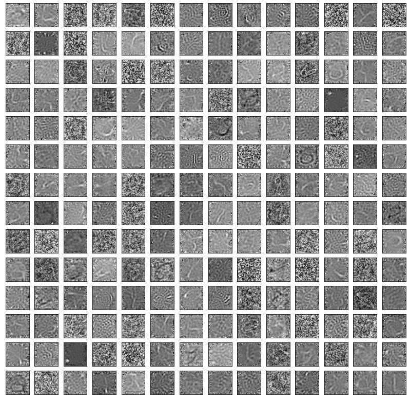|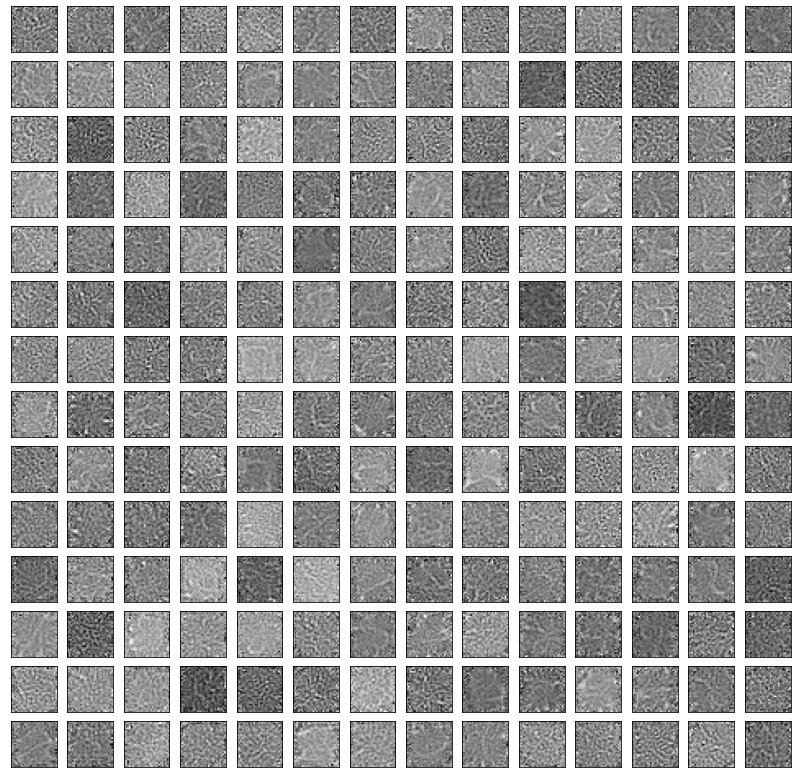|
|---|---|
|figure5a|figure5a|

|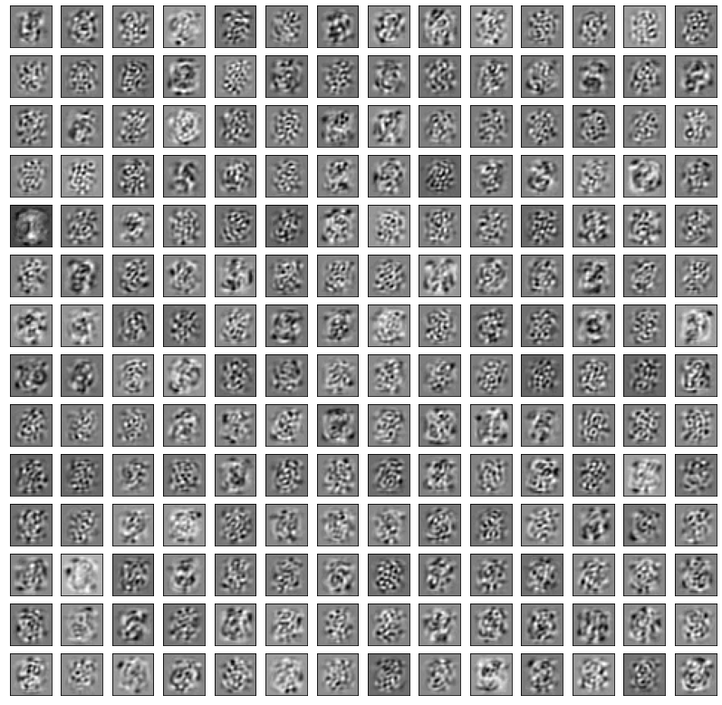|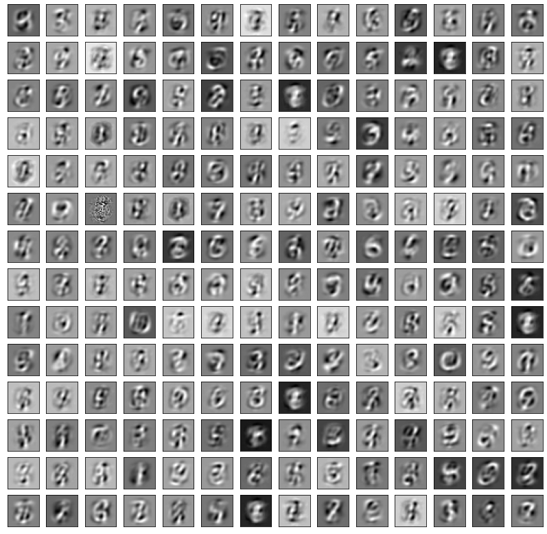|
|---|---|
|figure5c|figure5d|

figure5a: Encoder weight matrix of L1 activity regularizer on encoder layer 
figure5b: Encoder weight matrix of L2 activity regularizer on encoder layer 
figure5c: Encoder weight matrix of L2 kernel regularizer on encoder layer 
figure5d: Encoder weight matrix of L2 kernel regularizer on encoder and decoder layer 
figure5a,5b: {'activity_regularizer': 8.888888888888889e-05, 'kernel_regularizer': 0.0} 
figure5a,5b: {'activity_regularizer': 0.0, 'kernel_regularizer': 8.888888888888889e-05}

## 5. Original image vs latent space vs reconstructed image

This session is to visualize what have been mentioned in 
session [2](#2-mse-loss-comparison) and [3](#3-sparsity-comparison)
the more blurry the reconstructed image is, the higher the MSE loss is;
the less bright spot the latent space has, the lower the sparisty is.

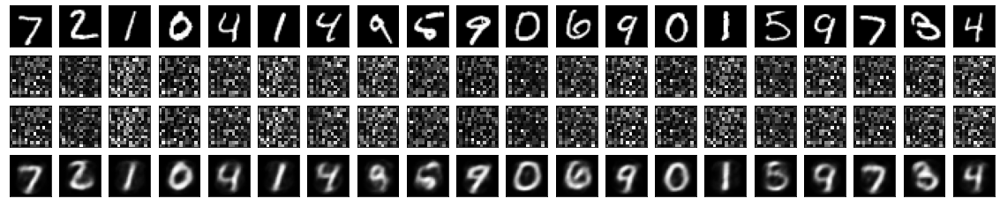

figure6 is from L2 kernel regularizer on encoder and decoder layer 
{'activity_regularizer': 0.0, 'kernel_regularizer': 8.888888888888889e-05} 
top row: original images of random digits 
2nd row: latent space 
3rd row: l2 normalized latent space (unit vector) 
4rd row: reconstructed images (unit vector)

## 6. Cosine similarity of same vs different digit

This session is to compare the cosine distance between latent space of images with same digits, 
vs images with different digit. 
For L1/L2 activity regularizer ('activity_regularizer': 6.67e-05) and dropout ('dropout_rate': 0.6) on encoder layer, 
the cosine distance is degraded to ~0.6 for both same digit and different digit cases [figure6a,6b,6c]

|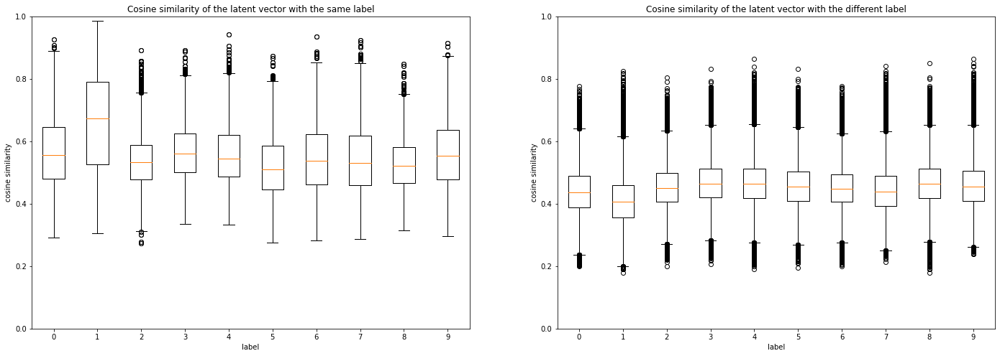|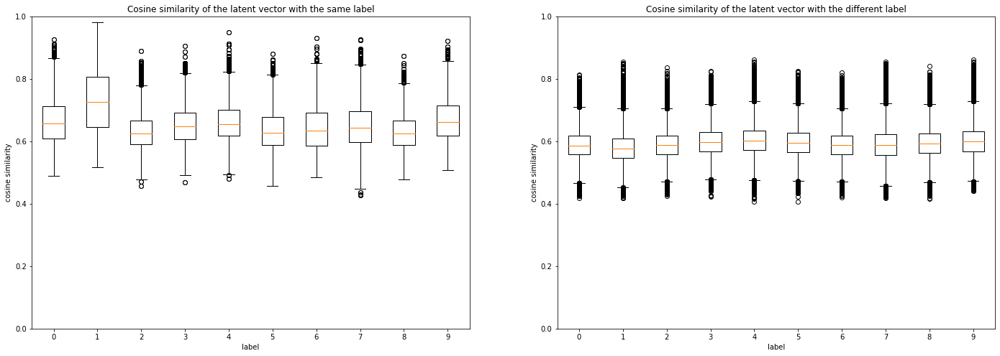|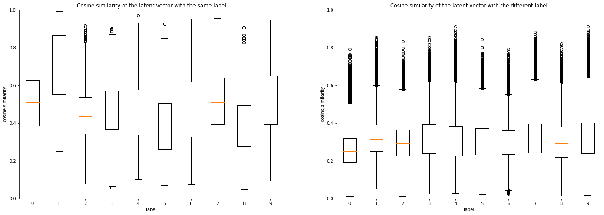|
|---|---|---|
|figure6a|figure6b|figure6c|

figure6a: Cosine similarity of same / different digits of L1 activity regularizer on encoder layer 
figure6b: Cosine similarity of same / different digits of L2 activity regularizer on encoder layer 
figure6c: Cosine similarity of same / different digits of dropout on encoder layer 
figure6a,6b: {'activity_regularizer': 6.67e-05} 
figure6c: {'dropout_rate': 0.6}

 
 

The cosine distance for L1/L2 kernel regularizer on encoder layer and L2 encoder+decoder layer 
can be maintained at ~0.8, and there is a slight observable uplift in cosine distance for images with same digit 
[figure7a,7b,7c].

|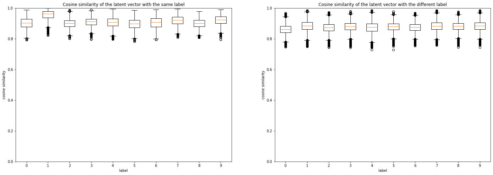|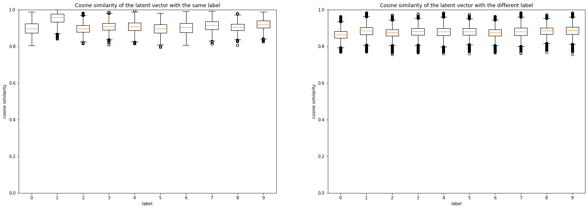|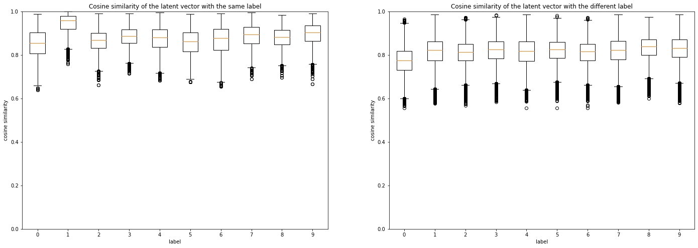|
|---|---|---|
|figure7a|figure7b|figure7c|

figure7a: Cosine similarity of same / different digits of L1 kernel regularizer on encoder layer 
figure7b: Cosine similarity of same / different digits of L2 kernel regularizer on encoder layer 
figure7c: Cosine similarity of same / different digits of L2 kernel regularizer on encoder layer + decoder layer 
figure6a,6b: {'kernel_regularizer': 6.67e-05} 
figure6c: {'dropout_rate': 0.6}

## 7. Euclidean distance behavior

2 analyses are done based on euclidean distance: T-SNE on latent space (color by digit labels) 
and K-means followed by silhouette score. However, there is no distinguishable insight from these 2 analyses. 
Moreover, L1 kernel regularizer on both encoder + decoder layer crash T-SNE due to high sparsity in latent space 
[figure8b].

|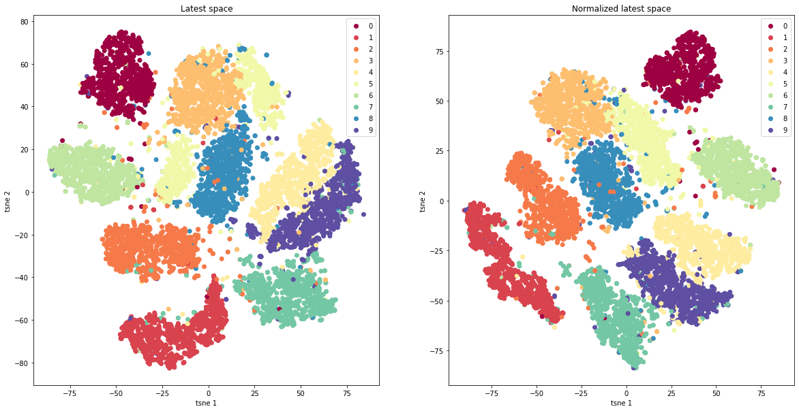|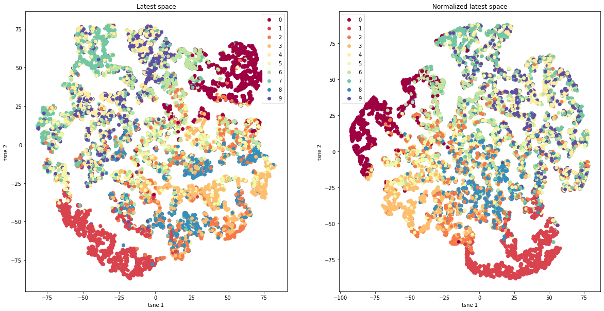|
|---|---|
|figure8a|figure8b|

figure8a: Cosine similarity of same / different digits of L2 kernel regularizer on encoder + decoder layer 
figure8b: Cosine similarity of same / different digits of L1 kernel regularizer on encoder + decoder layer 
figure8a,8b: {'kernel_regularizer': 6.67e-05} 

 
 

Below is the silhouette score plot from K-means on latent space from L2 kernel regularizer on encoder + decoder layer.
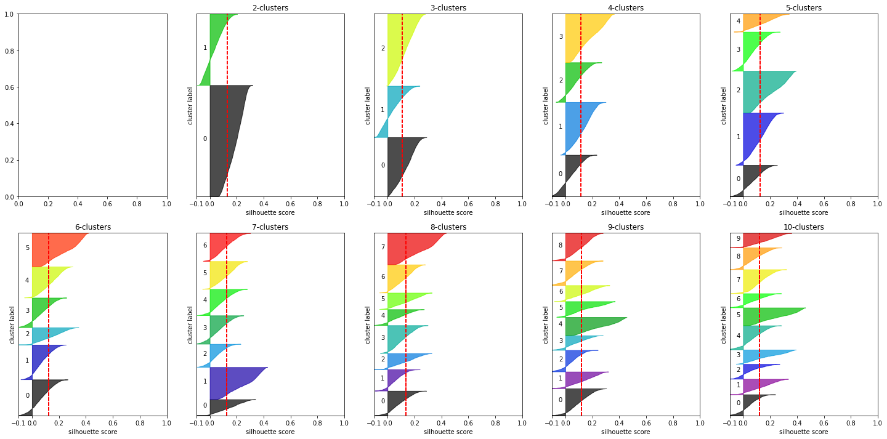